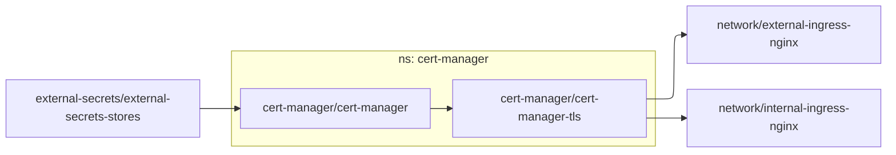

```mermaid
---
config:
  layout: elk
---
flowchart LR

  subgraph "ns: cert-manager"
    cert-manager/cert-manager-tls
    cert-manager/cert-manager --> cert-manager/cert-manager-tls
  end
  cert-manager/cert-manager-tls --> network/external-ingress-nginx
  cert-manager/cert-manager-tls --> network/internal-ingress-nginx
  external-secrets/external-secrets-stores --> cert-manager/cert-manager
```
