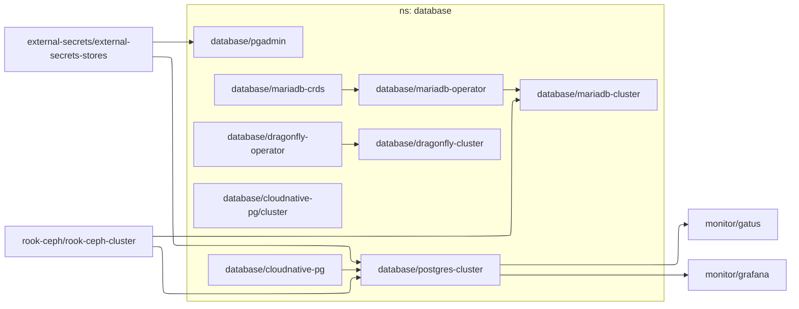

```mermaid
---
config:
  layout: elk
---
flowchart LR

  subgraph "ns: database"
    database/cloudnative-pg
    database/cloudnative-pg/cluster
    database/dragonfly-cluster
    database/dragonfly-operator
    database/mariadb-cluster
    database/mariadb-crds
    database/mariadb-operator
    database/pgadmin
    database/cloudnative-pg --> database/postgres-cluster
    database/dragonfly-operator --> database/dragonfly-cluster
    database/mariadb-crds --> database/mariadb-operator
    database/mariadb-operator --> database/mariadb-cluster
  end
  database/postgres-cluster --> monitor/gatus
  database/postgres-cluster --> monitor/grafana
  external-secrets/external-secrets-stores --> database/pgadmin
  external-secrets/external-secrets-stores --> database/postgres-cluster
  rook-ceph/rook-ceph-cluster --> database/mariadb-cluster
  rook-ceph/rook-ceph-cluster --> database/postgres-cluster
```
