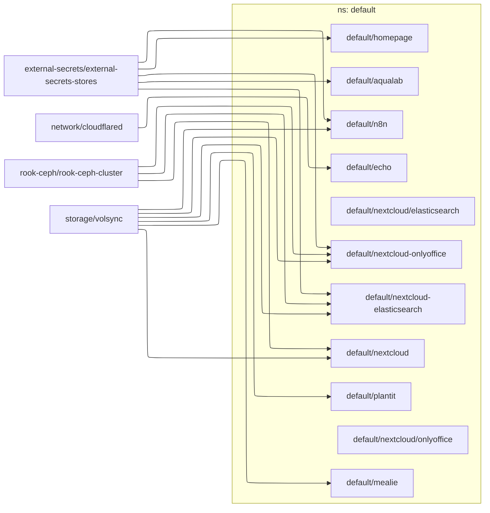

```mermaid
---
config:
  layout: elk
---
flowchart LR

  subgraph "ns: default"
    default/aqualab
    default/echo
    default/homepage
    default/mealie
    default/n8n
    default/nextcloud
    default/nextcloud-elasticsearch
    default/nextcloud-onlyoffice
    default/nextcloud/elasticsearch
    default/nextcloud/onlyoffice
    default/plantit
  end
  external-secrets/external-secrets-stores --> default/aqualab
  external-secrets/external-secrets-stores --> default/homepage
  external-secrets/external-secrets-stores --> default/n8n
  external-secrets/external-secrets-stores --> default/nextcloud-elasticsearch
  external-secrets/external-secrets-stores --> default/nextcloud-onlyoffice
  network/cloudflared --> default/echo
  rook-ceph/rook-ceph-cluster --> default/nextcloud
  rook-ceph/rook-ceph-cluster --> default/nextcloud-elasticsearch
  rook-ceph/rook-ceph-cluster --> default/nextcloud-onlyoffice
  storage/volsync --> default/mealie
  storage/volsync --> default/n8n
  storage/volsync --> default/nextcloud
  storage/volsync --> default/nextcloud-elasticsearch
  storage/volsync --> default/nextcloud-onlyoffice
  storage/volsync --> default/plantit
```
