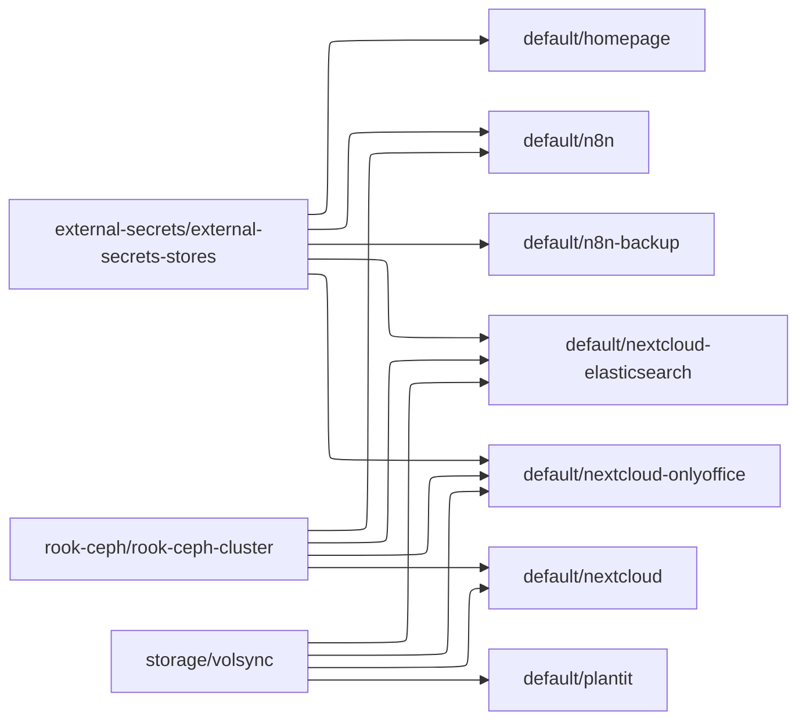

```mermaid
---
config:
  layout: elk
---
flowchart LR

  external-secrets/external-secrets-stores --> default/homepage
  external-secrets/external-secrets-stores --> default/n8n
  external-secrets/external-secrets-stores --> default/n8n-backup
  external-secrets/external-secrets-stores --> default/nextcloud-elasticsearch
  external-secrets/external-secrets-stores --> default/nextcloud-onlyoffice
  rook-ceph/rook-ceph-cluster --> default/n8n
  rook-ceph/rook-ceph-cluster --> default/nextcloud
  rook-ceph/rook-ceph-cluster --> default/nextcloud-elasticsearch
  rook-ceph/rook-ceph-cluster --> default/nextcloud-onlyoffice
  storage/volsync --> default/nextcloud
  storage/volsync --> default/nextcloud-elasticsearch
  storage/volsync --> default/nextcloud-onlyoffice
  storage/volsync --> default/plantit
```
