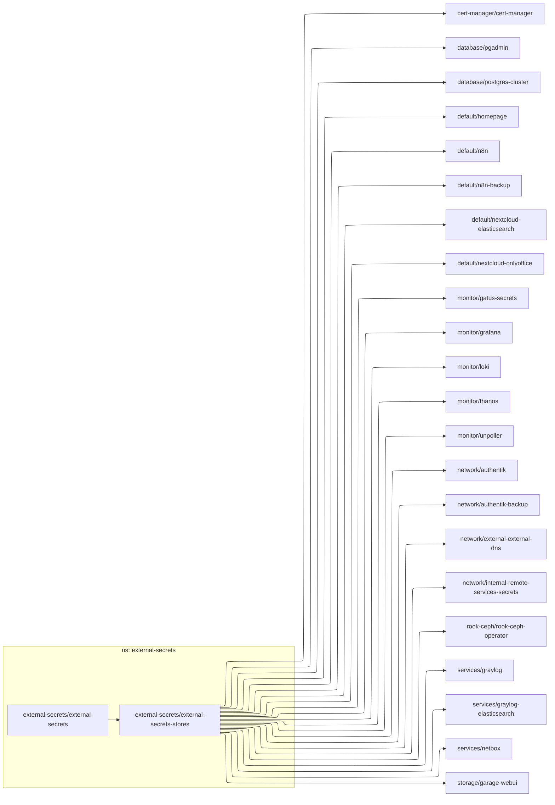

```mermaid
---
config:
  layout: elk
---
flowchart LR

  subgraph "ns: external-secrets"
    external-secrets/external-secrets --> external-secrets/external-secrets-stores
  end
  external-secrets/external-secrets-stores --> cert-manager/cert-manager
  external-secrets/external-secrets-stores --> database/pgadmin
  external-secrets/external-secrets-stores --> database/postgres-cluster
  external-secrets/external-secrets-stores --> default/homepage
  external-secrets/external-secrets-stores --> default/n8n
  external-secrets/external-secrets-stores --> default/n8n-backup
  external-secrets/external-secrets-stores --> default/nextcloud-elasticsearch
  external-secrets/external-secrets-stores --> default/nextcloud-onlyoffice
  external-secrets/external-secrets-stores --> monitor/gatus-secrets
  external-secrets/external-secrets-stores --> monitor/grafana
  external-secrets/external-secrets-stores --> monitor/loki
  external-secrets/external-secrets-stores --> monitor/thanos
  external-secrets/external-secrets-stores --> monitor/unpoller
  external-secrets/external-secrets-stores --> network/authentik
  external-secrets/external-secrets-stores --> network/authentik-backup
  external-secrets/external-secrets-stores --> network/external-external-dns
  external-secrets/external-secrets-stores --> network/internal-remote-services-secrets
  external-secrets/external-secrets-stores --> rook-ceph/rook-ceph-operator
  external-secrets/external-secrets-stores --> services/graylog
  external-secrets/external-secrets-stores --> services/graylog-elasticsearch
  external-secrets/external-secrets-stores --> services/netbox
  external-secrets/external-secrets-stores --> storage/garage-webui
```
