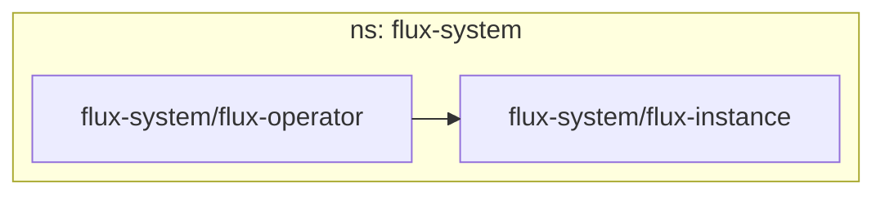

```mermaid
---
config:
  layout: elk
---
flowchart LR

  subgraph "ns: flux-system"
    flux-system/flux-instance
    flux-system/flux-operator
    flux-system/flux-operator --> flux-system/flux-instance
  end
```
