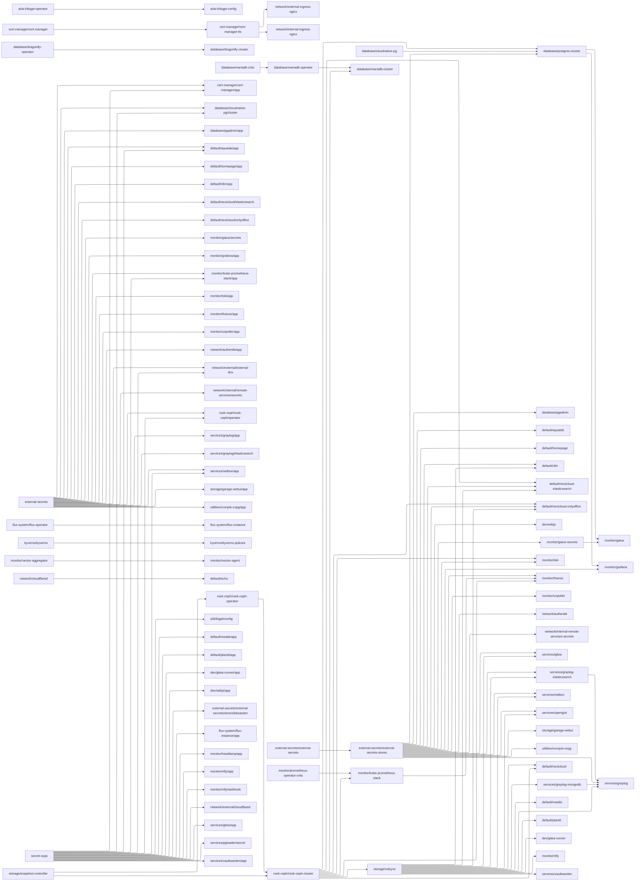

```mermaid
---
config:
  layout: elk
---
flowchart LR

  ai/ai-k8sgpt-operator --> ai/ai-k8sgpt-config
  cert-manager/cert-manager --> cert-manager/cert-manager-tls
  cert-manager/cert-manager-tls --> network/external-ingress-nginx
  cert-manager/cert-manager-tls --> network/internal-ingress-nginx
  database/cloudnative-pg --> database/postgres-cluster
  database/dragonfly-operator --> database/dragonfly-cluster
  database/mariadb-crds --> database/mariadb-operator
  database/mariadb-operator --> database/mariadb-cluster
  database/postgres-cluster --> monitor/gatus
  database/postgres-cluster --> monitor/grafana
  external-secrets --> cert-manager/cert-manager/app
  external-secrets --> database/cloudnative-pg/cluster
  external-secrets --> database/pgadmin/app
  external-secrets --> default/aqualab/app
  external-secrets --> default/homepage/app
  external-secrets --> default/n8n/app
  external-secrets --> default/nextcloud/elasticsearch
  external-secrets --> default/nextcloud/onlyoffice
  external-secrets --> monitor/gatus/secrets
  external-secrets --> monitor/grafana/app
  external-secrets --> monitor/kube-prometheus-stack/app
  external-secrets --> monitor/loki/app
  external-secrets --> monitor/thanos/app
  external-secrets --> monitor/unpoller/app
  external-secrets --> network/authentik/app
  external-secrets --> network/external/external-dns
  external-secrets --> network/internal/remote-services/secrets
  external-secrets --> rook-ceph/rook-ceph/operator
  external-secrets --> services/graylog/app
  external-secrets --> services/graylog/elasticsearch
  external-secrets --> services/netbox/app
  external-secrets --> storage/garage-webui/app
  external-secrets --> utilities/cronjob-cnpg/app
  external-secrets/external-secrets --> external-secrets/external-secrets-stores
  external-secrets/external-secrets-stores --> database/pgadmin
  external-secrets/external-secrets-stores --> database/postgres-cluster
  external-secrets/external-secrets-stores --> default/aqualab
  external-secrets/external-secrets-stores --> default/homepage
  external-secrets/external-secrets-stores --> default/n8n
  external-secrets/external-secrets-stores --> default/nextcloud-elasticsearch
  external-secrets/external-secrets-stores --> default/nextcloud-onlyoffice
  external-secrets/external-secrets-stores --> dev/wikijs
  external-secrets/external-secrets-stores --> monitor/gatus-secrets
  external-secrets/external-secrets-stores --> monitor/grafana
  external-secrets/external-secrets-stores --> monitor/loki
  external-secrets/external-secrets-stores --> monitor/thanos
  external-secrets/external-secrets-stores --> monitor/unpoller
  external-secrets/external-secrets-stores --> network/authentik
  external-secrets/external-secrets-stores --> network/internal-remote-services-secrets
  external-secrets/external-secrets-stores --> services/gitea
  external-secrets/external-secrets-stores --> services/graylog
  external-secrets/external-secrets-stores --> services/graylog-elasticsearch
  external-secrets/external-secrets-stores --> services/netbox
  external-secrets/external-secrets-stores --> services/opengist
  external-secrets/external-secrets-stores --> storage/garage-webui
  external-secrets/external-secrets-stores --> utilities/cronjob-cnpg
  flux-system/flux-operator --> flux-system/flux-instance
  kyverno/kyverno --> kyverno/kyverno-policies
  monitor/gatus-secrets --> monitor/gatus
  monitor/kube-prometheus-stack --> monitor/thanos
  monitor/prometheus-operator-crds --> monitor/kube-prometheus-stack
  monitor/vector-aggregator --> monitor/vector-agent
  network/cloudflared --> default/echo
  rook-ceph/rook-ceph-cluster --> database/mariadb-cluster
  rook-ceph/rook-ceph-cluster --> database/postgres-cluster
  rook-ceph/rook-ceph-cluster --> default/nextcloud
  rook-ceph/rook-ceph-cluster --> default/nextcloud-elasticsearch
  rook-ceph/rook-ceph-cluster --> default/nextcloud-onlyoffice
  rook-ceph/rook-ceph-cluster --> monitor/kube-prometheus-stack
  rook-ceph/rook-ceph-cluster --> monitor/loki
  rook-ceph/rook-ceph-cluster --> monitor/thanos
  rook-ceph/rook-ceph-cluster --> storage/volsync
  rook-ceph/rook-ceph-operator --> rook-ceph/rook-ceph-cluster
  secret-sops --> ai/k8sgpt/config
  secret-sops --> cert-manager/cert-manager/app
  secret-sops --> database/cloudnative-pg/cluster
  secret-sops --> default/aqualab/app
  secret-sops --> default/mealie/app
  secret-sops --> default/plantit/app
  secret-sops --> dev/gitea-runner/app
  secret-sops --> dev/wikijs/app
  secret-sops --> external-secrets/external-secrets/stores/bitwarden
  secret-sops --> flux-system/flux-instance/app
  secret-sops --> monitor/headlamp/app
  secret-sops --> monitor/kube-prometheus-stack/app
  secret-sops --> monitor/ntfy/app
  secret-sops --> monitor/ntfy/webhook
  secret-sops --> network/external/cloudflared
  secret-sops --> network/external/external-dns
  secret-sops --> rook-ceph/rook-ceph/operator
  secret-sops --> services/gitea/app
  secret-sops --> services/netbox/app
  secret-sops --> services/pgloader/secret
  secret-sops --> services/vaultwarden/app
  services/graylog-elasticsearch --> services/graylog
  services/graylog-mongodb --> services/graylog
  storage/snapshot-controller --> rook-ceph/rook-ceph-cluster
  storage/snapshot-controller --> rook-ceph/rook-ceph-operator
  storage/volsync --> default/mealie
  storage/volsync --> default/n8n
  storage/volsync --> default/nextcloud
  storage/volsync --> default/nextcloud-elasticsearch
  storage/volsync --> default/nextcloud-onlyoffice
  storage/volsync --> default/plantit
  storage/volsync --> dev/gitea-runner
  storage/volsync --> monitor/ntfy
  storage/volsync --> services/gitea
  storage/volsync --> services/graylog
  storage/volsync --> services/graylog-elasticsearch
  storage/volsync --> services/graylog-mongodb
  storage/volsync --> services/netbox
  storage/volsync --> services/opengist
  storage/volsync --> services/vaultwarden
```
