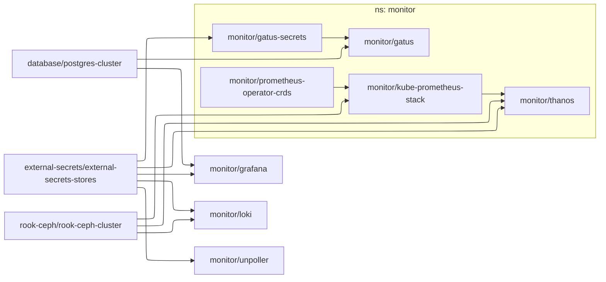

```mermaid
---
config:
  layout: elk
---
flowchart LR

  subgraph "ns: monitor"
    monitor/gatus-secrets --> monitor/gatus
    monitor/kube-prometheus-stack --> monitor/thanos
    monitor/prometheus-operator-crds --> monitor/kube-prometheus-stack
  end
  database/postgres-cluster --> monitor/gatus
  database/postgres-cluster --> monitor/grafana
  external-secrets/external-secrets-stores --> monitor/gatus-secrets
  external-secrets/external-secrets-stores --> monitor/grafana
  external-secrets/external-secrets-stores --> monitor/loki
  external-secrets/external-secrets-stores --> monitor/thanos
  external-secrets/external-secrets-stores --> monitor/unpoller
  rook-ceph/rook-ceph-cluster --> monitor/kube-prometheus-stack
  rook-ceph/rook-ceph-cluster --> monitor/loki
  rook-ceph/rook-ceph-cluster --> monitor/thanos
```
