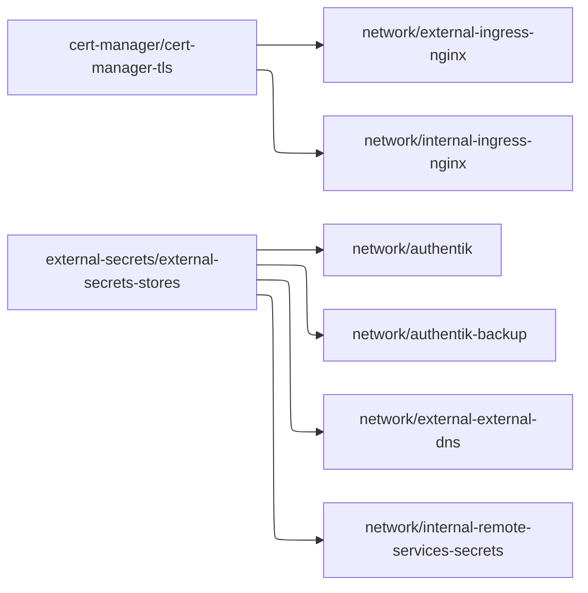

```mermaid
---
config:
  layout: elk
---
flowchart LR

  cert-manager/cert-manager-tls --> network/external-ingress-nginx
  cert-manager/cert-manager-tls --> network/internal-ingress-nginx
  external-secrets/external-secrets-stores --> network/authentik
  external-secrets/external-secrets-stores --> network/authentik-backup
  external-secrets/external-secrets-stores --> network/external-external-dns
  external-secrets/external-secrets-stores --> network/internal-remote-services-secrets
```
