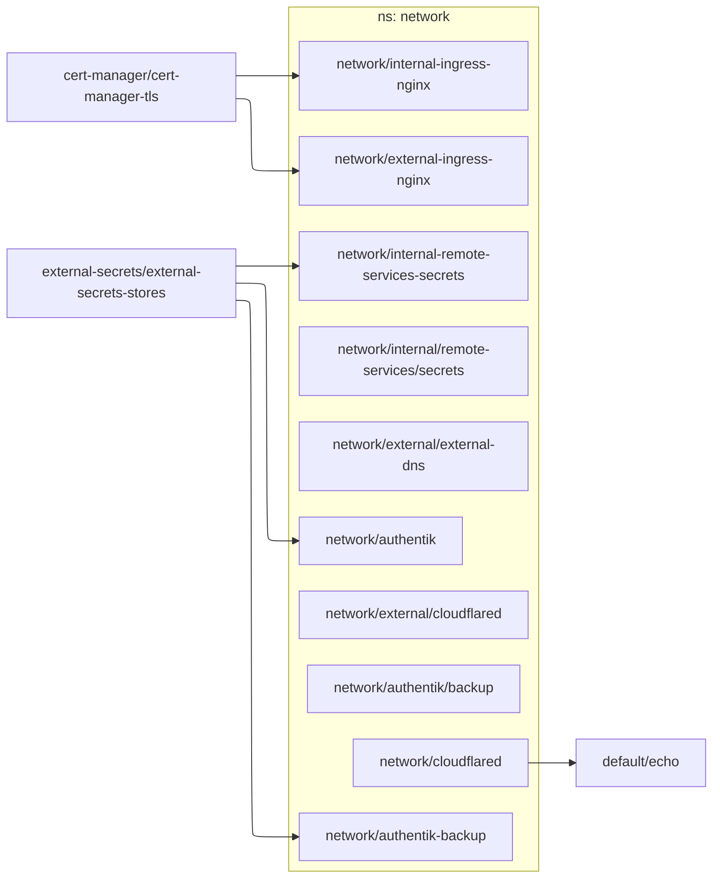

```mermaid
---
config:
  layout: elk
---
flowchart LR

  subgraph "ns: network"
    network/authentik
    network/authentik-backup
    network/authentik/backup
    network/cloudflared
    network/external-ingress-nginx
    network/external/cloudflared
    network/external/external-dns
    network/internal-ingress-nginx
    network/internal-remote-services-secrets
    network/internal/remote-services/secrets
  end
  cert-manager/cert-manager-tls --> network/external-ingress-nginx
  cert-manager/cert-manager-tls --> network/internal-ingress-nginx
  external-secrets/external-secrets-stores --> network/authentik
  external-secrets/external-secrets-stores --> network/authentik-backup
  external-secrets/external-secrets-stores --> network/internal-remote-services-secrets
  network/cloudflared --> default/echo
```
