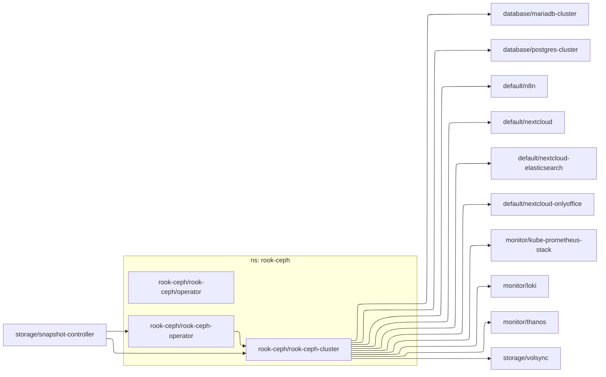

```mermaid
---
config:
  layout: elk
---
flowchart LR

  subgraph "ns: rook-ceph"
    rook-ceph/rook-ceph-operator
    rook-ceph/rook-ceph/operator
    rook-ceph/rook-ceph-operator --> rook-ceph/rook-ceph-cluster
  end
  rook-ceph/rook-ceph-cluster --> database/mariadb-cluster
  rook-ceph/rook-ceph-cluster --> database/postgres-cluster
  rook-ceph/rook-ceph-cluster --> default/n8n
  rook-ceph/rook-ceph-cluster --> default/nextcloud
  rook-ceph/rook-ceph-cluster --> default/nextcloud-elasticsearch
  rook-ceph/rook-ceph-cluster --> default/nextcloud-onlyoffice
  rook-ceph/rook-ceph-cluster --> monitor/kube-prometheus-stack
  rook-ceph/rook-ceph-cluster --> monitor/loki
  rook-ceph/rook-ceph-cluster --> monitor/thanos
  rook-ceph/rook-ceph-cluster --> storage/volsync
  storage/snapshot-controller --> rook-ceph/rook-ceph-cluster
  storage/snapshot-controller --> rook-ceph/rook-ceph-operator
```
