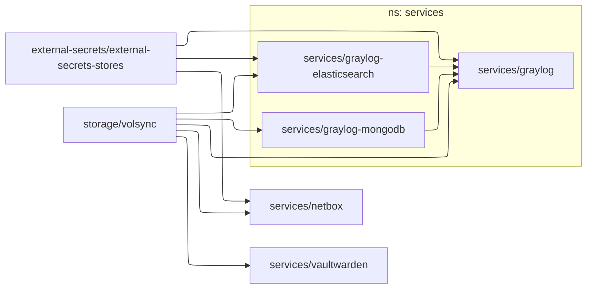

```mermaid
---
config:
  layout: elk
---
flowchart LR

  subgraph "ns: services"
    services/graylog-elasticsearch --> services/graylog
    services/graylog-mongodb --> services/graylog
  end
  external-secrets/external-secrets-stores --> services/graylog
  external-secrets/external-secrets-stores --> services/graylog-elasticsearch
  external-secrets/external-secrets-stores --> services/netbox
  storage/volsync --> services/graylog
  storage/volsync --> services/graylog-elasticsearch
  storage/volsync --> services/graylog-mongodb
  storage/volsync --> services/netbox
  storage/volsync --> services/vaultwarden
```
