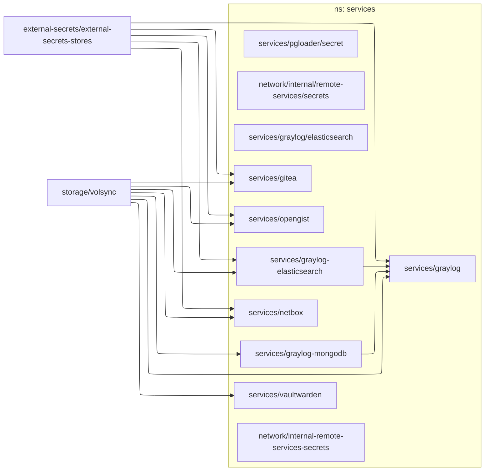

```mermaid
---
config:
  layout: elk
---
flowchart LR

  subgraph "ns: services"
    network/internal-remote-services-secrets
    network/internal/remote-services/secrets
    services/gitea
    services/graylog/elasticsearch
    services/netbox
    services/opengist
    services/pgloader/secret
    services/vaultwarden
    services/graylog-elasticsearch --> services/graylog
    services/graylog-mongodb --> services/graylog
  end
  external-secrets/external-secrets-stores --> services/gitea
  external-secrets/external-secrets-stores --> services/graylog
  external-secrets/external-secrets-stores --> services/graylog-elasticsearch
  external-secrets/external-secrets-stores --> services/netbox
  external-secrets/external-secrets-stores --> services/opengist
  storage/volsync --> services/gitea
  storage/volsync --> services/graylog
  storage/volsync --> services/graylog-elasticsearch
  storage/volsync --> services/graylog-mongodb
  storage/volsync --> services/netbox
  storage/volsync --> services/opengist
  storage/volsync --> services/vaultwarden
```
