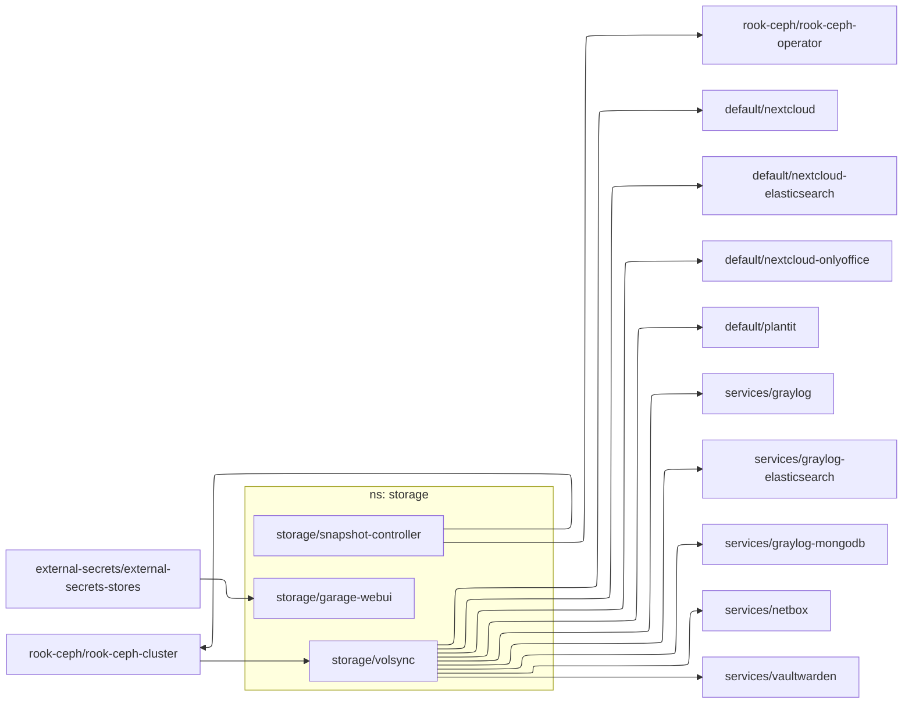

```mermaid
---
config:
  layout: elk
---
flowchart LR

  subgraph "ns: storage"
    storage/garage-webui
    storage/snapshot-controller
    storage/volsync
  end
  external-secrets/external-secrets-stores --> storage/garage-webui
  rook-ceph/rook-ceph-cluster --> storage/volsync
  storage/snapshot-controller --> rook-ceph/rook-ceph-cluster
  storage/snapshot-controller --> rook-ceph/rook-ceph-operator
  storage/volsync --> default/nextcloud
  storage/volsync --> default/nextcloud-elasticsearch
  storage/volsync --> default/nextcloud-onlyoffice
  storage/volsync --> default/plantit
  storage/volsync --> services/graylog
  storage/volsync --> services/graylog-elasticsearch
  storage/volsync --> services/graylog-mongodb
  storage/volsync --> services/netbox
  storage/volsync --> services/vaultwarden
```
