# 📊 Kubernetes App Dependencies

Automatically generated dependency graphs for each namespace.

## 🔗 Full Dependency Graph

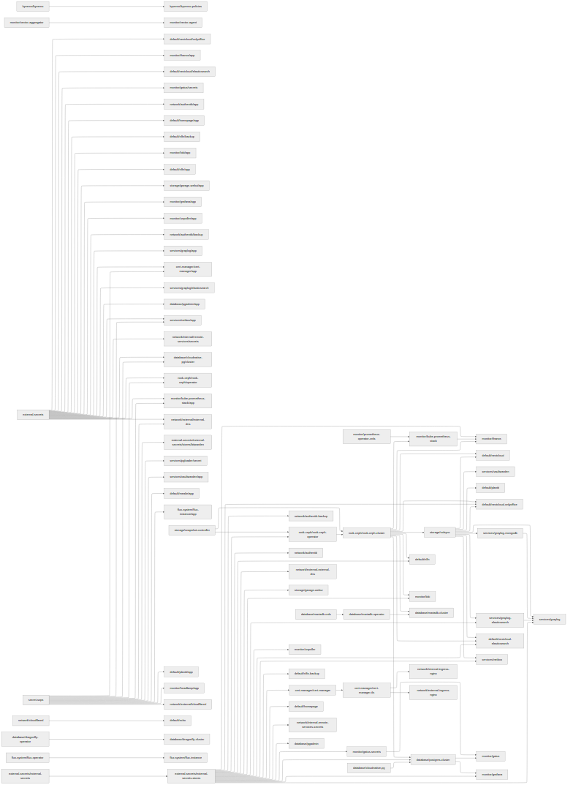

## 📂 Namespace Dependency Graphs

### cert-manager

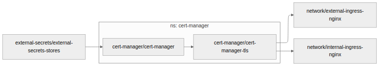

### database

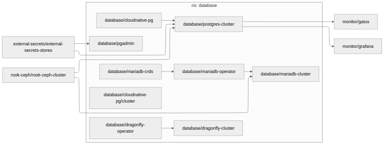

### default

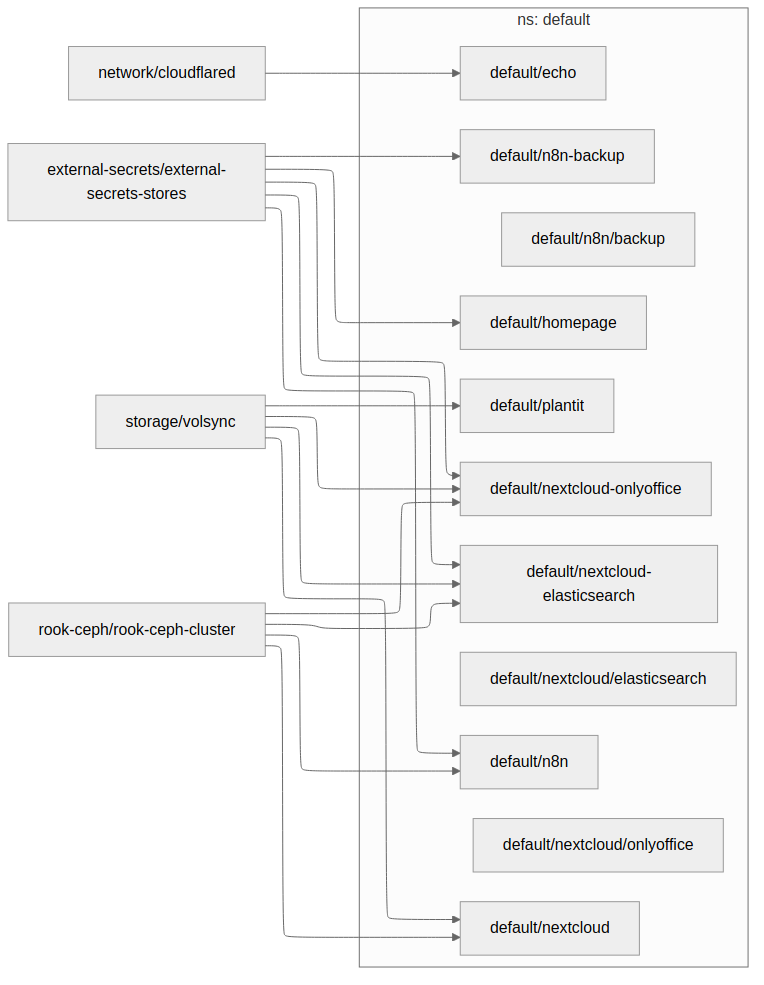

### external-secrets

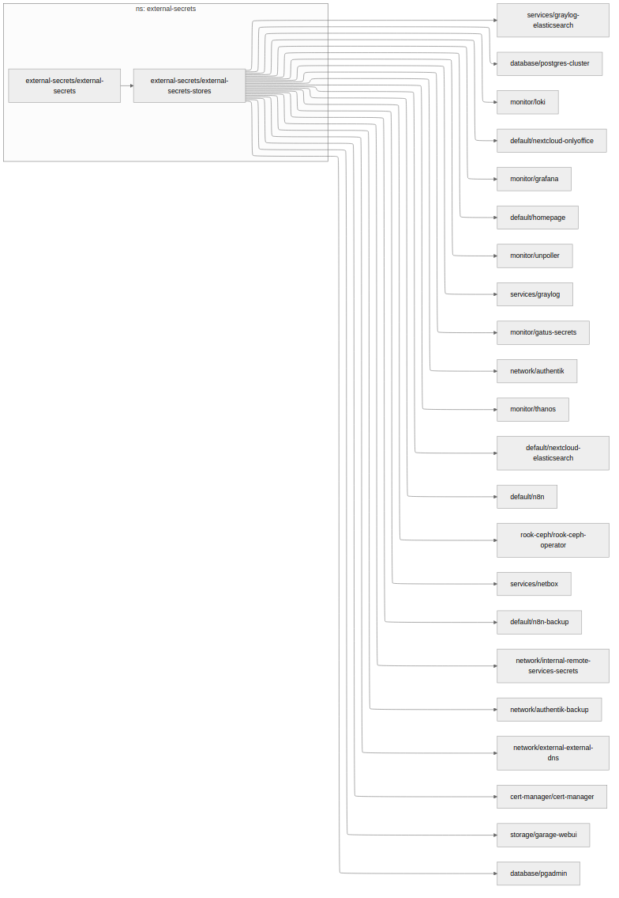

### flux-system

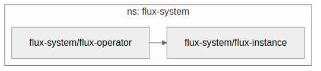

### kyverno

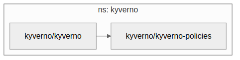

### monitor

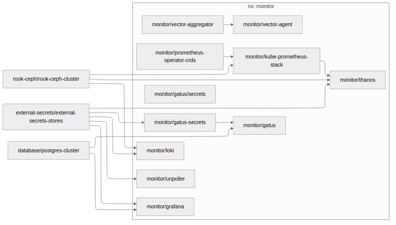

### network

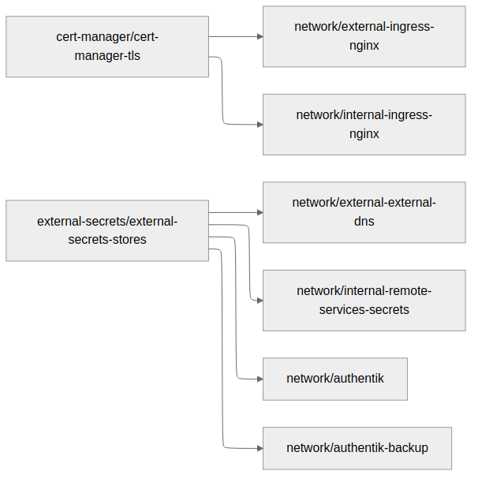

### rook-ceph

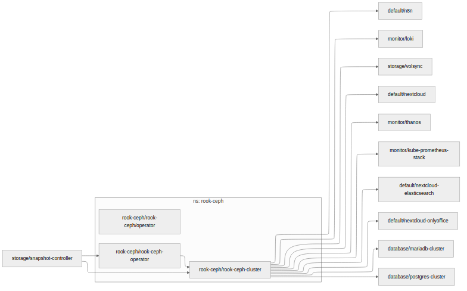

### services


### storage

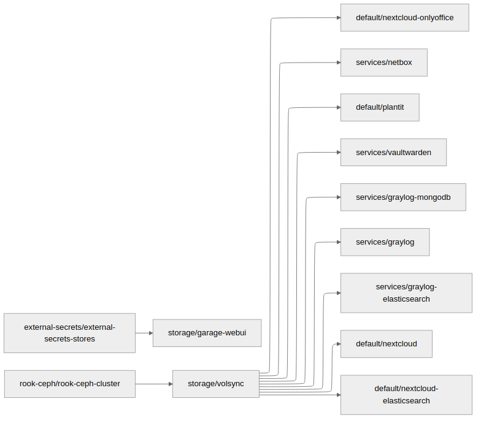

## 📋 Summary

```
SOPS Secrets:
  - ai/k8sgpt/config
  - cert-manager/cert-manager/app
  - database/cloudnative-pg/cluster
  - default/aqualab/app
  - default/mealie/app
  - default/plantit/app
  - dev/gitea-runner/app
  - dev/wikijs/app
  - external-secrets/external-secrets/stores/bitwarden
  - flux-system/flux-instance/app
  - monitor/headlamp/app
  - monitor/kube-prometheus-stack/app
  - monitor/ntfy/app
  - monitor/ntfy/webhook
  - network/external/cloudflared
  - network/external/external-dns
  - rook-ceph/rook-ceph/operator
  - services/gitea/app
  - services/netbox/app
  - services/pgloader/secret
  - services/vaultwarden/app

External Secrets:
  - cert-manager/cert-manager/app
  - database/cloudnative-pg/cluster
  - database/pgadmin/app
  - default/aqualab/app
  - default/homepage/app
  - default/n8n/app
  - default/nextcloud/elasticsearch
  - default/nextcloud/onlyoffice
  - monitor/gatus/secrets
  - monitor/grafana/app
  - monitor/kube-prometheus-stack/app
  - monitor/loki/app
  - monitor/thanos/app
  - monitor/unpoller/app
  - network/authentik/app
  - network/external/external-dns
  - network/internal/remote-services/secrets
  - rook-ceph/rook-ceph/operator
  - services/graylog/app
  - services/graylog/elasticsearch
  - services/netbox/app
  - storage/garage-webui/app
  - utilities/cronjob-cnpg/app

Using Both:
  - cert-manager/cert-manager/app
  - database/cloudnative-pg/cluster
  - default/aqualab/app
  - monitor/kube-prometheus-stack/app
  - network/external/external-dns
  - rook-ceph/rook-ceph/operator
  - services/netbox/app

Namespaces with no dependencies (no file created):
  - kube-system

HelmRelease dependsOn blocks:
  - default/echo:
      → network/cloudflared
  - flux-system/flux-instance:
      → flux-system/flux-operator
  - monitor/loki:
      → rook-ceph/rook-ceph-cluster
  - monitor/vector-agent:
      → monitor/vector-aggregator
  - rook-ceph/rook-ceph-cluster:
      → rook-ceph/rook-ceph-operator
      → storage/snapshot-controller
  - rook-ceph/rook-ceph-operator:
      → storage/snapshot-controller
```
